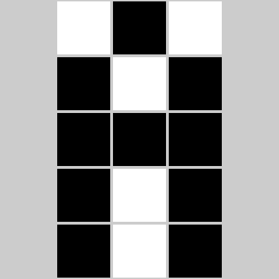

# Code.org Grapher
On 10/2/17, in AP Computer Science Principles, I was supposed to draw a black-and-white picture in [code.org](https://code.org)'s b&w image widget. The format is a two-byte header (one byte representing the width and the other the height), and a stream of bits, each one representing a black or white pixel (0 for black, 1 for white).

#### Example:
```
0000 0011
0000 0101
101010000010010
```
becomes



## So, What Does This Thing Do?
Basically, it's a library that graphs a function by creating an image compatible with the code.org black-and-white or color image tool. Just pass it a few parameters and it'll spit out a string of binary or hex that you can copy and paste into the widget.

## Usage
You can use the grapher on anything that supports ES6, including imports. If people really want CommonJS imports, you have full license to change the last line to `module.exports = Grapher;`. **This is different than version 2 and before!**

### General Use
Just so I don't have to type things twice, here are the instructions applicable to b&w and color graphs:

1. Install from npm
  * `npm i code.org-grapher`
2. Import the library
  *
  ```javascript
  import Grapher from 'code.org-grapher';
  ```
3. Instantiate a plot
  * `let parabola = new Grapher(254, 254, x => Math.pow(x, 2), <options>);`
4. Graph the plot
  * `parabola.graph(<options>).then(pic => console.log(pic));`
5. (optional) include an `options` object somewhere. There are two places you can put your options: as the fourth parameter of the `Grapher` constructor or as the sole parameter of the `graph` method (shown above in angle brackets).
6. Copy-and-paste or programmatically inset the result into the code.org widget.

#### Multiple Graphs
You can easily add graphs to your plot: just change the third parameter of the constructor to an array of equations. i.e. `new Grapher(254, 254, [x => x*x, x => x*x*x]);`

### Black-and-white
By default, all plots are drawn in black-and-white. All you have to do is use the class as shown above; the header is even generated for you! However, you do have some options:

```javascript
let options = {
  y: "center" || "left" || "right",
  x: "center" || "top" || "bottom",
  axes: false || true
}
```

* `options.x`: tells the grapher where to put the x axis on the plot. It DOES move the graph's center to that location.
* `options.y`: same as `options.x` but it moves the y axis
* `options.axes`: whether or not to draw the x and y axis

*Note: the default for each property is listed first.*

### Color
I've tried to make color as easy to enable as possible; therefore, there are many ways to enable color. Unfortunately, I have not created a way to generate the header

1. In an `options` object, set `color` to a truthy value 
  * If you used `true` as the value, follow step 2.
  * If you used a hex color code, all graphs will be colored that color. You are done!
2. In an `options` object, set `colors` to an array of hex color codes that matches the length of your graphs array (if it's an array).

```javascript
let options = {
  color: false || true || "<hex color code>",
  colors: undefined || Array<"hex color code">
}
```

*Note: the default for each property is listed first.*

## Examples:
**Each example is in the `test/test.js` file.**
```javascript
// Require the grapher library
const Grapher = require("../lib/grapher");

// Instantiate a plot that graphs a parabola on a 254x254 image
let parabola = new Grapher(254, 254, x => 2 * x * x + 3 * x);

// Do the same for a line, but it also draws the axes
let line = new Grapher(254, 254, x => .5 * x, { axes: true });

// Move the axes (kind of broken right now. I'm working on it.)
let sin = new Grapher(254, 254, x => 10 * Math.sin(x / 10), { x: "bottom", y: "right", axes: true });

// This one has multiple graphs and colors.
let multi = new Grapher(254, 254,
  [
    x => .25 * x * x,
    x => 10 * Math.sqrt(x),
    x => Math.abs(x),
    x => 10 * Math.sin(Math.cos(x / 10))
  ],
  {
    axes: true,
    x: "center",
    y: "center",
    color: true,
    colors: ["ff0000", "00ff00", "0000ff", "ff00ff"]
  }
);

// Graph them:
parabola.graph().then(picture => console.log(picture));
line.graph().then(picture => console.log(picture));
// You can change settings when graphing
sin.graph({x: "center", y: "center"}).then(picture => console.log(picture));
multi.graph().then(picture => console.log(picture));
```

## API Reference
**Coming Soon**
